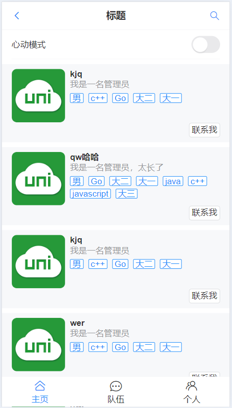
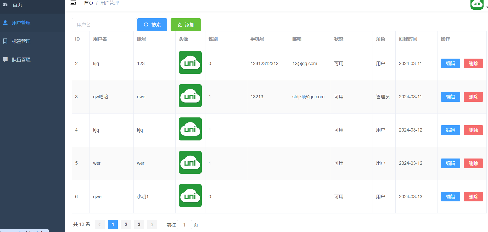

## 🍌项目介绍

### 介绍

友缘相逢是一个专为寻找真挚友谊和志同道合伙伴而打造的交友网站。我们利用标签交友系统，帮助用户快速找到与自己兴趣相投的朋友。在友缘相逢，你不仅可以轻松浏览各类交友信息，还能一键创建队伍，与志同道合的伙伴共同探索新乐趣。我们致力于为用户提供一个安全、友好、高效的交友平台，让每一次相遇都充满美好与期待。加入友缘相逢，开启你的交友新篇章！

### 前台界面

 <center>
     
</center>

### 管理员界面



## 🍒技术

### 前端

- Vue3
- Vant UI组件库
- Vite打包工具
- Vue Elememt Admin
- Echarts

### 后端

- MySQL
- Redis
- Minio对象存储
- Swagger+Knife4接口文档
- SpringBoot
- MyBatis Plus

## 🍓快速启动

1. 修改后端yml文件
2. 创建数据库
3. 修改前后台.env.development环境变量
4. 启动后端项目
5. 启动前端项目

```shell
npm run dev
```

## 🍎部署

### 安装Docker和Docker  Compose

```shell
# 安装存储库
sudo yum install -y yum-utils
# 设置镜像源
yum-config-manager --add-repo http://mirrors.aliyun.com/docker-ce/linux/centos/docker-ce.repo
# 安装docker引擎
yum install docker-ce docker-ce-cli containerd.io docker-buildx-plugin docker-compose-plugin
```

### 服务部署表格

|  服务名  |        英文名         | 端口号 |  版本  | 服务类别 |
| :------: | :-------------------: | :----: | :----: | :------: |
|  数据库  |         MySQL         |  3306  | 5.7.26 | 环境依赖 |
|   缓存   |         Redis         |  6379  | 5.0.5  | 环境依赖 |
| 后端服务 | meet-friends-backend  |  8081  | 1.0.0  | 业务服务 |
| 前端服务 | meet-friends-frontend |   80   | 1.0.0  | 业务服务 |

### 修改配置文件

在buddy-vue3文件里修改前台.env.production中服务器地址

在frontend文件里修改后台台.env.production中服务器地址

```shell
# 打包前台
npm run build
# 打包后台
npm run build:prod
```

### 启动

上传项目文件到服务器

```shell
# 启动环境依赖
docker compose -f docker-compose.env.yml up -d
# 启动业务服务
docker compose -f docker-compose.service.yml up -d
```

